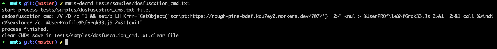

# MMTS

MM tools scripts

## blogs

[Desfuscation](https://ddvvmmzz.github.io/Windows-CMD%E5%91%BD%E4%BB%A4%E5%8E%BB%E6%B7%B7%E6%B7%86)
## Insatall

```
$ pip install mmts
```

## Usage

### 1. Command

```sh
# decmd
# In the `$cmd_file` file, there is one obfuscation command per line. After the execution is completed, a `$cmd_file.clear` file is generated in the current directory, and the command after deobfuscation is saved.
$ mmts-decmd $cmd_file

# parse lnk
$ mmts-parselnk $cmd_file
```

### 2. Quick Start

### decmd

```python
from mmts import de_dosfuscation_work

def main():
    clear_str = de_dosfuscation_work("mix_str")
    print(clear)

if __name__ == "__main__":
    main()
```

## Example

